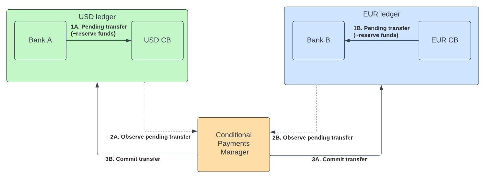
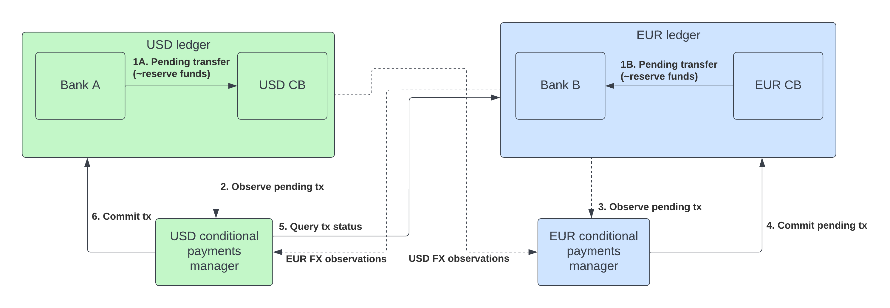

# Payment-vs-Payment example using the M10 Ledger

## Introduction

This repository provides a sample PvP coordination service using programmable payments instead of typical blockchain smart contracts.
The `service` implemented using the `M10 NodeJS SDK` guarantees atomic execution of a Currency A <-> Currency B by using two-staged transfers & actions on the M10 network. Signed quotes can be published to the M10 ledger(s) & will be verified on both ledgers. Only once both parties have successfully created a `Pending transfer`, thereby putting the funds on hold, will the `conditional-payment-manager` complete the swap.

The service can be run as a centralized actor, as depicted below:


Or it can be run as a distributed process neighbouring each ledger, as depicted below:


The default service in this repository deploys the `Centralized` model. However by running a single agent in `index.ts` & deploying multiple instances, the `Distributed` model can easily be achieved.

## Requirements

* [node-js](https://nodejs.org/en/download/) (Expected version "~16")
* [yarn](https://classic.yarnpkg.com/lang/en/docs/install/#mac-stable)
* [m10 CLI](https://github.com/m10io/sdk/releases)

## Before you begin

1. Download the latest M10 CLI [release](https://github.com/m10io/sdk/releases) as `m10` and put into you into your path
2. Create the `pvpManager.pkcs8` private key you'll use for the rest of this demo
```sh
# Generate an M10 keypair
m10 create key-pair pvpManager.pkcs8

# Output as Base64 to verify
base64 pvpManager.pkcs8
```

## How to build & prepare for simulation

A distribution-ready pvpManager simulation cli & service can be created using `yarn && yarn build`, within the `cli` or the `service` directories respectively.

Open the repository in two terminal windows and run:
Window 1
```sh
cd cli && yarn && yarn build
```

Window 2
```sh
cd service && yarn && yarn build
```

In both windows export some environment variables:
```sh
# export the keys for use in the path
export LOCAL_KEY_PAIR=$(base64 ../pvpManager.pkcs8)
export REMOTE_KEY_PAIR=$(base64 ../pvpManager.pkcs8)
# export the ledger public URLs
export LOCAL_LEDGER_URL=develop.m10.net
export REMOTE_LEDGER_URL=develop.m10.net
# export the ledger root key, used for simulation of granting proper RBAC permissions
export ROOT_KEY_PAIR="MFMCAQEwBQYDK2VwBCIEIHyr+m5Z4gy9JxoMdgrrX/EE8uhzkj3ztWx28zJxpStqoSMDIQAAIwpWR4i34vnPf3GTlge6ONw3tsuGer5QiQsGXKY0zg=="
# export the bank admin key, used for simulation of initating the flow as the bank
export BANK_KEY_PAIR="MFMCAQEwBQYDK2VwBCIEIPTfjmouJ351G6zHdRRqzvGKPamXNjFb5cIVBN0MmqLAoSMDIQDNiOnzUfVHzu0nUeNeiqR5xXZ6j5YYFL4OWmgeG6qqKQ=="
```

next you will:
1. Run the `setup` command in the m10-fx-pvp CLI in window 1
2. Start the pvpManager service(s) in window 2
3. Initiate the PvP flow with the `quote` command in the m10-fx-pvp CLI in window 1
4. Observe the execution of flow in window 2

## m10-fx-pvp CLI setup in window 1

The CLI allows for simulating the environment for a PvP interaction including the relevant parties and permissions, as well as simulating a real time quote ready for execution by both trade counterparties. The CLI has two commands:
- `setup`: for simulating setting up the required roles, role-bindings & accounts, which would typically be done as a prerequisite to having access to trade
- `quote`: for simulating initiationg of the RFQ interaction flow, which would typically be done by an individual, bank or intermediary

```sh
# Navigate to the cli folder and ensure it is built:
cd ./cli && yarn build

# Run the setup flow
# Uses the root key (provided) to initialize the roles & role-bindings
# Binds the pvp manager role to your pvp manager key
./bin/run setup \
 --server=$LOCAL_LEDGER_URL \
 --rootKeyPair=$ROOT_KEY_PAIR \
 --pvpKeyPair=$LOCAL_KEY_PAIR
```

## Run the service in window 2


```sh
# Navigate to the service folder and ensure it is built:
cd ./service && yarn build

# run the service distribution built above
yarn start
```

The key pairs are a priviledged keypairs previously created & bound to the `conditional-payment-manager` role on each ledger.
These were given the appropriate RBAC permission with the `setup` command in the `cli` above.

## m10-fx-pvp CLI quote command in window 1

Initializing & executing a quote can be done interactively through the `quote` command:

```sh
# Run the quote flow
./bin/run quote \
 --ledger=$LOCAL_LEDGER_URL \
 --keyPair=$BANK_KEY_PAIR \
 --from=00000000000000000000000000000001 \
 --to=04000000000000000000000000000001 \
 --baseAmount=100 \
 --targetAmount=91
```

This will execute a swap for 100 of the currency held by account ID `00000000000000000000000000000001` vs 91 of the currency held by account ID `04000000000000000000000000000001`

## Observe the completion of the flow in window 1

After creating and signing the quote request, the CLI provides you the option to initiate the PvP flow by submitting the first initialization transfer step. Accept this and observe the pvpManager acknowledge this request. Then accept the second leg of flow from the CLI prompt, and observe the pvpManager respond to the second initiate request and complete the flow for both parties.
