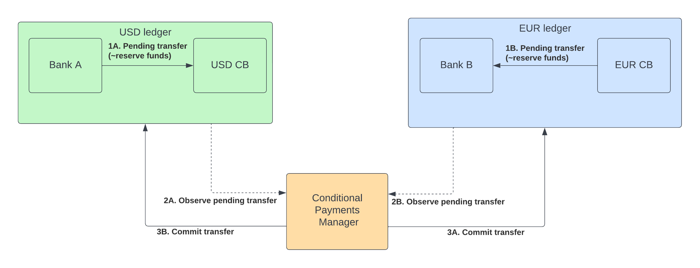

# Payment-vs-Payment example using the M10 Ledger

## Introduction

This repository provides a sample PvP coordination service using programmable payments instead of typical blockchain smart contracts.
The `service` implemented using the `M10 NodeJS SDK` guarantees atomic execution of a Currency A <-> Currency B by using two-staged transfers & actions on the M10 network. Signed quotes can be published to the M10 ledger(s) & will be verified on both ledgers. Only once both parties have successfully created a `Pending transfer`, thereby putting the funds on hold, will the `conditional-payment-manager` complete the swap.



## Requirements

* [node-js](https://nodejs.org/en/download/)
* [yarn](https://classic.yarnpkg.com/lang/en/docs/install/#mac-stable)

## How to develop

A development service instance with change-detection & hot-reload can be started using
```sh
yarn dev
```

## How to build

A distribution-ready service/cli can be created using, within either the `cli` or the `service` directories.
```sh
yarn build
```

## How to run the service

The distribution package can be run using
```sh
LOCAL_KEY_PAIR=<my_key_pair> REMOTE_KEY_PAIR=<my_key_pair> yarn start
```
or using the distribution dir of your choice: `<dir>`
```sh
LOCAL_KEY_PAIR=<my_key_pair> REMOTE_KEY_PAIR=<my_key_pair> node <dir>/index.js
```

the `<my_key_pair>` is either a priviledged keypair previously created & bound to the `conditional-payment-manager` role.
In order to create one use the SETUP command in the `cli`, see below.

## CLI

The CLI allows setting up the required roles, role-bindings & accounts using the `setup` command:

```sh
# Build the CLI
yarn build

# Generate an M10 keypair
m10 create key-pair pvpManager.pkcs8

# Run the setup flow
# Uses the root key to initialize the roles & role-bindings
# Binds the pvp manager role to the pvp manager
./bin/run setup -s m10.net -f m10_root.pkcs8 -F pvpManager.pkcs8

# Output as Base64
base64 ./pvpManager.pkcs8
```

Initializing & executing a quote can be done interactively through the `quote` command:

```sh
# Build the CLI
yarn build

# Run the quote flow
./bin/run quote -s m10.net -f bank_admin.pkcs8 -B 00000000000000000000000000000001 -b 100 -T 04000000000000000000000000000001 -t 91
```

which will execute a swap for 100 of the currency held by account ID `00000000000000000000000000000001` vs 91 of the currency held by account ID `04000000000000000000000000000001`